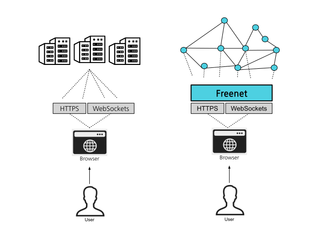

# Introduction

With the popularization of the world wide web in the 1990s, the Internet was
set on a path to centralization due to the web's client-server model. 

Three decades later, a handful of companies now effectively control the Internet
infrastructure. These companies have the power to censor, surveil, and
exclude people in a way that was never possible before outside of totalitarian
regimes.

Freenet is a drop-in decentralized replacement for the current world wide web.

The Freenet kernel is a small piece of software which runs on users' computers,
smartphones, or other devices. This kernel both gives users access to Freenet
and allows them to be participants in the network. The kernel is tiny, less than
5 MB, allowing it to be installed installed in a matter of seconds and is
compatible with a wide range of hardware.

Freenet is a peer-to-peer network, which means that nodes self-organize into a
global network without any central authority, and the work of hosting services
is distributed among the users.